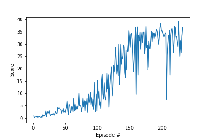

## Table of contents
* [Learning Algorithm](#learning-algorithm)
* [Plot of Rewards](#plot-of-rewards)
* [Ideas for Future Work](#ideas-for-future-work)

## Learning Algorithm
The Deep Deterministic Policy Gradient (DDPG) algorithm was used to solve this problem for a "single Agent". This algorithm was proposed by [Lillicrap et al., 2016][1].

There are many other algorithms also which can work well on this problem. Some of these are:

1. Advantage Actor-Critic, A2C ([Mnih et al., 2016][3])
2. Proximal Policy Optimization, PPO  ([Schulman et al., 2017][4])
3. Distributed Distributional Deep Deterministic Policy Gradient, D4PG ([Barth-Maron et al., 2018][5])

#### Algorithm advantages

- It can handle continuous multi-dimensional action spaces better than Deep Q-network algorithm proposed by [Mnih et al., 2015][2]
- It has a simple actor-critic architecture which is easy to implement and scale
- The paper ([Lillicrap et al., 2016][1]) claims that the algorithm was able to learn good policies for many problems while keeping the hyperparameters and network structure constant.

#### Algorithm steps
- Randomly initialize a "local" actor network (state mapped to action) and a "local" critic network (state and action pair mapped to Q value)
- Copy the weights of local actor and local critic network to a set of "target" actor and critic networks. 
- Initialize a replay buffer R
- For each episode do the following:
    - Initialize noise (OU process)
    - Obtain observation state s_{t}
    - For each time step:
        - Choose action a_{t} based on currect actor network and noise
        - Execute a_{t} and observe reward r_{t} and new state s_{t+1}
        - Store (s_{t}, a_{t}, r_{t}, s_{t+1}) in R
        - Sample a minibatch of N transitions from R
        - Use the mean squared error between estimated Q value from target critic network using a_{t+1} obtained from target actor network and Q value from the local critic network. Minimize this error with respect to local critic network
        - For all states s_{t} in the minibatch, find the action a'_{t} predicted by the local actor network and then compute the average Q value from the local critic network for all such state action pairs. Maximize the average Q value with respect to local actor network
        - Update the target networks using soft update rule
    

#### Algorithm features
The DDPG algorithm has adopted recent advances from various other papers to address problems related to deep reinforcement learning:

1. Sequential samples are highly correlated. This can affect training of neural networks. As in DQN, this algorithm uses replay buffer.

2. Both the actor and critic networks are updated at each step. The target values for these networks are also updated at each step. In order to ensure stable convergence, the algorithm uses another set of "target" actor and critic networks whose weights are updated slowly at each step. 

3. Vector observations from an environment may have different physical units which can scale differently. The DDPG algorithm uses the batch normalization technique to "whiten" the state input and all the layers of the actor and critic networks. 

4. Ornstein-Uhlenbeck process is used to introduce temporally correlated noise to the actor policy. This was done to allow for exploration. 

#### Model architecture
We used the same model architecture and model hyperparameters as described in the DDPG paper. Both the actor and critic networks had two fully connected hidden layers with linear transformation. The first layer size was set to 400 and the second layer size was set to 300 in both networks. In the case of critic network the input to second layer was composed of 400 dimensional ouput from first layer plus the 4 dimensional action input. The rectilinear activation function is applied to the output of both hidden layers.  The input states and output of first hidden layer where subjected to batch normalization in both networks.

The final output layer of the actor was a 4 dimensional "tanh" layer to bound the actions and the final output layer of the critic was a 1 dimensional ReLU output representing the value of Q function.

The weights and biases of the hidden layers and output layers were initialized as described in the paper [Lillicrap et al., 2016][1].

#### Algorithm hyperparameters

* BUFFER_SIZE = int(1e6)  # replay buffer size
* BATCH_SIZE = 128        # minibatch size
* GAMMA = 0.99            # discount factor
* TAU = 1e-3              # for soft update of target parameters
* LR_ACTOR = 1e-4         # learning rate of the actor 
* LR_CRITIC = 1e-4        # learning rate of the critic
* WEIGHT_DECAY = 0        # L2 weight decay

OU process was used with theta = 0.15 and sigma = 0.2 
All the hyperparameters are as described in the paper except for BATCH_SIZE which was increased from 64 to 128, LR_CRITIC which was reduced from 1e-3 to 1e-4 and WEIGHT_DECAY which was reduced from 1e-2 to 0. We found that these changes helped improve the speed of learning.

We modified the DDPG implementation from the lessons to solve this problem. We increased the max_t variable in the ddpg function to 1000 otherwise the episodes where too short to achieve an average score of 30. 

We also modified the OU process implementation to use np.random.randn() instead of random.random(), since randn() gives normally distributed samples whereas random() gives uniformly distributed samples between 0 and 1. 

## Plot of Rewards
The model was able to solve the task in 232 episodes

Environment solved in 232 episodes!	Average Score: 30.10

## Ideas for Future Work
We could try the following things to speed up the learning using DDPG algorithm:
* Reduce the number of hidden layers in the actor and critic networks
* Try a different learning rate for actor and critic networks, a different value for weight_decay and batch size. 

We found that the hyperparameters and model architecture described in the DDPG paper are indeed sufficient to learn a good policy. However, it can be rather slow. The learning is stable but it comes at the cost of speed. We could also try using A2C or PPO based algorithms to see if it gives better results without compromising on speed. 

[1]: https://arxiv.org/abs/1509.02971
[2]: https://www.nature.com/articles/nature14236
[3]: https://arxiv.org/pdf/1602.01783.pdf
[4]: https://arxiv.org/pdf/1707.06347.pdf
[5]: https://openreview.net/pdf?id=SyZipzbCb
